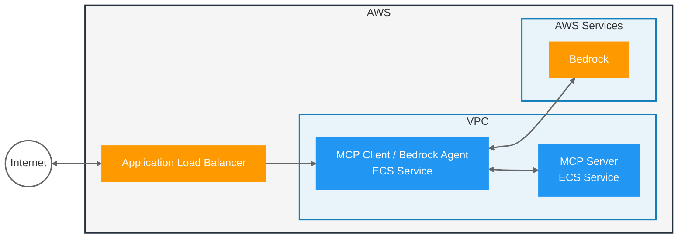

# Sample: MCP Agent with Spring AI and Bedrock

Provides a sample Spring AI MCP Server that runs on ECS; which is used by a Spring AI Agent using Bedrock; which also runs on ECS and is exposed publicly via a Load Balancer.



## Setup

1. Setup Bedrock in the AWS Console, [request access to Nova Pro](https://us-east-1.console.aws.amazon.com/bedrock/home?region=us-east-1#/modelaccess)
1. [Setup auth for local development](https://docs.aws.amazon.com/cli/v1/userguide/cli-chap-authentication.html)

## Run Locally

Start the MCP Server:
```
./gradlew :server:bootRun
```

Start the MCP Client / Agent:
```
./gradlew :client:bootRun
```

Make a request to the server REST endpoint:

In IntelliJ, open the `client.http` file and run the request.

Or via `curl`:
```
curl -X POST --location "http://localhost:8080/inquire" \
    -H "Content-Type: application/json" \
    -d '{"question": "Get employees that have skills related to Java, but not Java"}'
```

## Run on AWS

Prereqs:
- [Create an ECR Repo named `mcp-agent-spring-ai-server` and one named `mcp-agent-spring-ai-client`](https://us-east-1.console.aws.amazon.com/ecr/private-registry/repositories/create?region=us-east-1)
- [Auth `docker` to ECR](https://docs.aws.amazon.com/AmazonECR/latest/userguide/registry_auth.html)
- [Install Rain](https://github.com/aws-cloudformation/rain)

Build and push the MCP Server & MCP Client to ECR:
```
export ECR_REPO=<your account id>.dkr.ecr.us-east-1.amazonaws.com

./gradlew :server:bootBuildImage --imageName=$ECR_REPO/mcp-agent-spring-ai-server

docker push $ECR_REPO/mcp-agent-spring-ai-server:latest


./gradlew :client:bootBuildImage --imageName=$ECR_REPO/mcp-agent-spring-ai-client

docker push $ECR_REPO/mcp-agent-spring-ai-client:latest
```

Deploy the Agent:
```
rain deploy infra.cfn mcp-agent-spring-ai
```

End-to-end Test with `curl`:
```
curl -X POST --location "http://YOUR_LB_HOST/inquire" \
-H "Content-Type: application/json" \
-d '{"question": "Get employees that have skills related to Java, but not Java"}'
```
